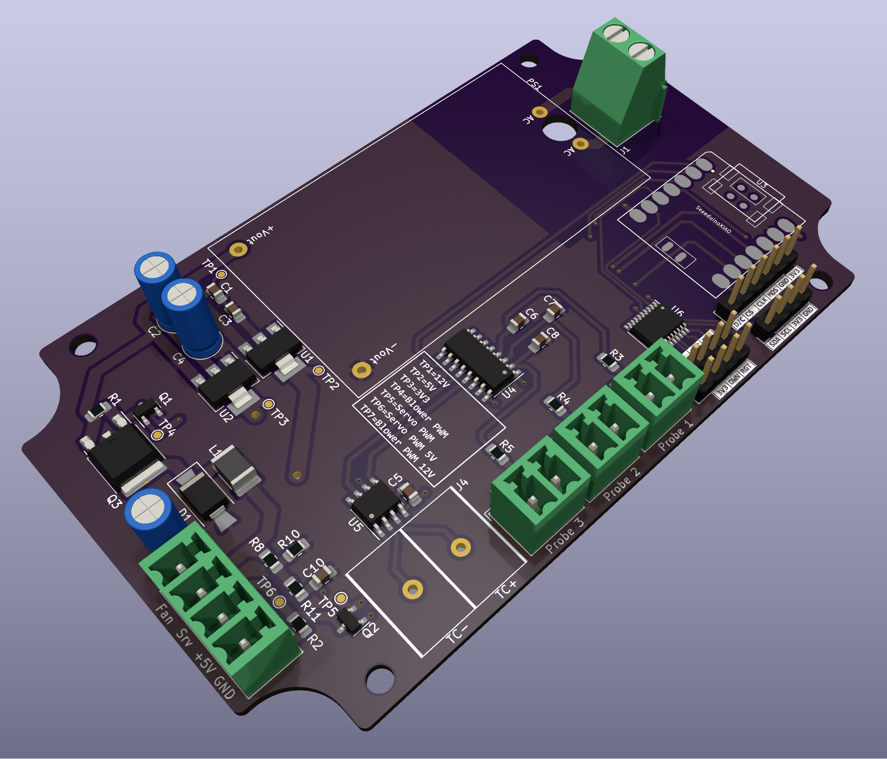

# HeaterMeter Redux

@CapnBry created the original HeaterMeter temperature controller for Kamado BBQ's. This is a placeholder for a new design I am working on. Here is a sneak preview of the PCB design:

# License

HeaterMeterRedux is ©2024 Jeroen Bouwens. It is licensed under CC BY-NC-SA 4.0. To view a copy of this license, visit http://creativecommons.org/licenses/by-nc-sa/4.0/
